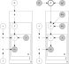

## Introduction

Philosophers and dramatists have long argued whether the most important element of narrative is *plot* or *character*. Under a classical Aristotelian perspective, plot is supreme;^["Dramatic action ... is not with a view to the representation of character: character comes in as subsidiary to the actions ... The Plot, then, is the first principle, and, as it were, the soul of a tragedy: Character holds the second place.” Poetics I.VI @aristotle_aristotles_-334.] modern theoretical dramatists and screenwriters disagree.^[Aristotle was mistaken in his time, and our scholars are mistaken today when they accept his rulings concerning character. Character was a great factor in Aristotle's time, and no fine play ever was or ever will be written without it” (Egri, 1946, p. 94); “What the reader wants is fascinating, complex characters” (McKee, 1997, 100).]

Without addressing this debate directly, much computational work on narrative has focused on learning the sequence of events by which a story is defined; in this tradition we might situate seminal work on learning procedural scripts [@schank_scripts_2013; @regneri_learning_2010], narrative chains (Chambers and Jurafsky, 2008), and plot structure (Finlayson, 2011; Elsner, 2012; McIntyre and Lapata, 2010; Goyal et al., 2010).

We present a complementary perspective that addresses the importance of *character* in defining a story. Our testbed is film. Under this perspective, a character's latent internal nature drives the action we observe. Articulating narrative in this way leads to a natural generative story: we first decide that we're going to make a particular kind of movie (e.g., a romantic comedy), then decide on a set of character types, or personas, we want to see involved (the `PROTAGONIST`, the `LOVE INTEREST`, the `BEST FRIEND`). After picking this set, we fill out each of these roles with specific attributes (female, 28 years old, klutzy); with this cast of characters, we then sketch out the set of events by which they interact with the world and with each other (runs but just misses the train, spills coffee on her boss) – through which they reveal to the viewer those inherent qualities about themselves.

This work is inspired by past approaches that infer typed semantic arguments along with narrative schemas (Chambers and Jurafsky, 2009; Regneri et al., 2011), but seeks a more holistic view of character, one that learns from stereotypical attributes in addition to plot events. This work also naturally draws on earlier work on the unsupervised learning of verbal arguments and semantic roles (Pereira et al., 1993; Grenager and Manning, 2006; Titov and Klementiev, 2012) and unsupervised relation discovery (Yao et al., 2011).

This character-centric perspective leads to two natural questions. First, can we learn what those standard personas are by how individual characters (who instantiate those types) are portrayed? Second, can we learn the set of attributes and actions by which we recognize those common types? How do we, as viewers, recognize a `VILLIAN`?

At its most extreme, this perspective reduces to learning the grand archetypes of Joseph Campbell (1949) or Carl Jung (1981), such as the `HERO` or `TRICKSTER`. We seek, however, a more fine-grained set that includes not only archetypes, but stereotypes as well – characters defined by a fixed set of actions widely known to be representative of a class. This work offers a data-driven method for answering these questions, presenting two proba-
blistic generative models for inferring latent character types.

This is the first work that attempts to learn explicit character personas in detail; as such, we present a new dataset for character type induction in film and a benchmark testbed for evaluating future work.^[All datasets and software for replication can be found at [http://www.ark.cs.cmu.edu/personas](http://www.ark.cs.cmu.edu/personas)]

## Data

### Text

Our primary source of data comes from 42,306 movie plot summaries extracted from the November 2, 2012 dump of English-language Wikipedia.^[[http://dumps.wikimedia.org/enwiki](http://dumps.wikimedia.org/enwiki)] These summaries, which have a median length of approximately 176 words,^[More popular movies naturally attract more attention on Wikipedia and hence more detail: the top 1,000 movies by box office revenue have a median length of 715 words] contain a concise synopsis of the movie's events, along with implicit descriptions of the characters (e.g., “rebel leader Princess Leia,” “evil lord Darth Vader”). To extract structure from this data, we use the Stanford CoreNLP library^[[http://nlp.stanford.edu/software/corenlp.shtml](http://nlp.stanford.edu/software/corenlp.shtml)] to tag and syntactically parse the text, extract entities, and resolve coreference within the document. With this structured representation, we extract linguistic features for each character, looking at immediate verb governors and attribute syntactic dependencies to all of the entity's mention headwords, extracted from the typed dependency tuples produced by the parser; we refer to “CCprocessed” syntactic relations described in de Marneffe and Manning (2008):

* **Agent verbs.** Verbs for which the entity is an agent argument (*nsubj* or *agent*).
* **Patient verbs.** Verbs for which the entity is the patient, theme or other argument (*dobj*, *nsubjpass*, *iobj*, or any prepositional argument *prep_\**).
* **Attributes.** Adjectives and common noun words that relate to the mention as adjectival modifiers, noun-noun compounds, appositives, or copulas (*nsubj* or *appos* governors, or *nsubj*, *appos*, *amod*, *nn* dependents of an entity mention).

These three roles capture three different ways in which character personas are revealed: the actions they take on others, the actions done to them, and the attributes by which they are described. For every character we thus extract a bag of $(r, w)$ tuples, where $w$ is the word lemma and $r$ is one of $\{\text{agent verb}, \text{patient verb}, \text{attribute}\}$ as identified by the above rules.

### Metadata

Our second source of information consists of character and movie metadata drawn from the November 4, 2012 dump of Freebase.^[[http://download.freebase.com/datadumps/](http://download.freebase.com/datadumps/)] At the movie level, this includes data on the language, country, release date and detailed genre (365 non-mutually exclusive categories, including “Epic Western,” “Revenge,” and “Hip Hop Movies”). Many of the characters in movies are also associated with the actors who play them; since many actors also have detailed biographical information, we can ground the characters in what we know of those real people – including their gender and estimated age at the time of the movie's release (the difference between the release date of the movie and the actor's date of birth).

Across all 42,306 movies, entities average 3.4 agent events, 2.0 patient events, and 2.1 attributes. For all experiments described below, we restrict our dataset to only those events that are among the 1,000 most frequent overall, and only characters with at least 3 events. 120,345 characters meet this criterion; of these, 33,559 can be matched to Freebase actors with a specified gender, and 29,802 can be matched to actors with a given date of birth. Of all actors in the Freebase data whose age is given, the average age at the time of movie is 37.9 (standard deviation 14.1); of all actors whose gender is known, 66.7% are male.8 The age distribution is strongly bimodal when conditioning on gender: the average age of a female actress at the time of a movie's release is 33.0 (s.d. 13.4), while that of a male actor is 40.5 (s.d. 13.7).

## Personas

One way we recognize a character's latent type is by observing the stereotypical actions they perform (e.g., `VILLAINS` *strangle*), the actions done to them (e.g., `VILLAINS` are *foiled* and *arrested*) and the words by which they are described (`VILLAINS` are *evil*). To capture this intuition, we define a *persona* as a set of three typed distributions: one for the words for which the character is the agent, one for which it is the patient, and one for words by which the character is attributively modified. Each distribution ranges over a fixed set of latent word classes, or *topics*. @fig-1 illustrates this definition for a toy example: a `ZOMBIE` persona may be characterized as being the agent of primarily *eating* and *killing* actions, the patient of *killing* actions, and the object of *dead* attributes. The topic labeled *eat* may include words like *eat*, *drink*, and *devour*.

{#fig-1 width="70%"}

## Models

Both models that we present here simultaneously learn three things: 1.) a soft clustering over words to topics (e.g., the verb “strangle” is mostly a type of *Assault* word); 2.) a soft clustering over topics to personas (e.g., `VILLIANS` perform a lot of *Assault* actions); and 3.) a hard clustering over characters to personas (e.g., Darth Vader is a `VILLAIN`.) They each use different evidence: since our data includes not only textual features (in the form of actions and attributes of the characters) but also non-textual information (such as movie genre, age and gender), we design a model that exploits this additional source of information in discriminating between character types; since this extra-linguistic information may not always be available, we also design a model that learns only from the text itself. We present the text-only model first for simplicity. Throughout, $V$ is the word vocabulary size, $P$ is the number of personas, and $K$ is the number of topics.

{#fig-2 width="80%"}

| | |
|:-:|:- |
| $P$ | Number of personas (hyperparameter) |
| $K$ | Number of word topics (hyperparameter) |
| $D$ | Number of movie plot summaries |
| $E$ | Number of characters in movie $d$ |
| $W$ | Number of (role, word) tuples used by character $e$ |
| $\phi_k$ | Topic $k$'s distribution over $V$ words |
| $r$ | Tuple role: agent verb, patient verb, attribute |
| $\psi_{p,r}$ | Distribution over topics for persona $p$ in role $r$ |
| $\theta_d$ | Movie $d$'s distribution over personas |
| $p_e$ | Character $e$'s persona (integer, $p \in \{1 \ldots P \}$) |
| $j$ | A specific $(r, w)$ tuple in the data |
| $z_j$ | Word topic for tuple $j$ |
| $w_j$ | Word for tuple $j$ |
| $\alpha$ | Concentration parameter for Dirichlet model |
| $\beta$ | Feature weights for regression model |
| $\mu, \sigma^2$ | Gaussian mean and variance (for regularizing $\beta$) |
| $m_d$ | Movie features (from movie metadata) |
| $m_e$ | Entity features (from movie actor metadata) |
| $\nu_r, \gamma$ | Dirichlet concentration parameters |

: Definition of variables {#tbl-1 tbl-colwidths="[20,80]"}

### Dirichlet Persona Model

In the most basic model, we only use information from the structured text, which comes as a bag of $(r, w)$ tuples for each character in a movie, where $w$ is the word lemma and $r$ is the relation of the word with respect to the character (one of $\text{agent verb}$, $\text{patient verb}$, or $\text{attribute}$, as outlined in §2.1 above). The generative story runs as follows. First, let there be $K$ latent word topics; as in LDA (Blei et al., 2003), these are words that will be soft-clustered together by virtue of appearing in similar contexts. Each latent word cluster $\phi_k \sim \text{Dir}(\gamma)$ is a multinomial over the $V$ words in the vocabulary, drawn from a Dirichlet parameterized by $\gamma$. Next, let a persona $p$ be defined as a set of three multinomials $\psi_p$ over these $K$ topics, one for each typed role $r$, each drawn from a Dirichlet with a role-specific hyperparameter ($\nu_r$).

Every document (a movie plot summary) contains a set of characters, each of which is associated with a single latent persona p; for every observed (r, w) tuple associated with the character, we sample a latent topic k from the role-specific ψp,r. Conditioned on this topic assignment, the observed word is drawn from φk. The distribution of these personas for a given document is determined by a document-specific multinomial θ, drawn from a Dirichlet parameterized by α.

@fig-2 (left) illustrates the form of the model. To simplify inference, we collapse out the persona-topic distributions ψ, the topic-word distributions φ and the persona distribution θ for each document. Inference on the remaining latent variables – the persona $p$ for each character type and the topic $z$ for each word associated with that character – is conducted via collapsed Gibbs sampling (Griffiths and Steyvers, 2004); at each iteration,
for each character $e$, we sample their persona $p_e$:

$$
\begin{aligned}
\Pr(p_e = k \mid p_{−e}, z, \alpha, \nu) \propto \\
\left(c^{−e}_{d,k} + \alpha_k\right)
\times
\prod_j \frac{
c^{−e}_{r_j,k,z_j} + \nu_{r_j}
}{
c^{−e}_{r_j,k,*} + K \nu_{r_j}
}
\end{aligned}
$$

Here, $c^{−e}_{d,k}$ is the count of all characters in document $d$ whose current persona sample is also $k$ (not counting the current character $e$ under consideration);^[The $−e$ superscript denotes counts taken without considering the current sample for character $e$] $j$ ranges over all $(r_j, w_j)$ tuples associated with character $e$. Each $c^{−e}_{r_j,k,z_j}$ is the count of all tuples with role $r_j$ and current topic $z_j$ used with persona $k$. $c^{−e}_{r_j,k,*}$ is the same count, summing over all topics $z$. In other words, the probability that character $e$ embodies persona $k$ is proportional to the number of other characters in the plot summary who also embody that persona (plus the Dirichlet hyperparameter $\alpha_k$) times the contribution of each observed word $w_j$ for that character, given its current topic assignment $z_j$.

Once all personas have been sampled, we sample the latent topics for each tuple as the following.

$$
\begin{aligned}
\Pr(zj = k \mid p, z−j , w, r, ν, γ) \propto \\
\frac{
  c^{−j}_{r_j,p,k} + \nu_{r_j}
}{
  c^{−j}_{r_j,p,*} + K \nu_{r_j}
}
\times 
\frac{
  c^{−j}_{k,w_j} + \gamma
}{
c^{−j}_{k,*} + V \gamma
}
\end{aligned}
$$

Here, conditioned on the current sample $p$ for the character's persona, the probability that tuple $j$ originates in topic $k$ is proportional to the number of other tuples with that same role $r_j$ drawn from the same topic for that persona ($c^{−j}_{r_j,p,k}$), normalized by the number of other $r_j$ tuples associated with that persona overall ($c^{−j}_{r_j,p,*}$), multiplied by the number of times word $w_j$ is associated with that topic ($c^{−j}_{k,w_j}$) normalized by the total number of other words associated with that topic overall ($c^{−j}_{k,*}$).

We optimize the values of the Dirichlet hyperparameters $\alpha$, $\nu$, and $\gamma$ using slice sampling with a uniform prior every 20 iterations for the first 500 iterations, and every 100 iterations thereafter. After a burn-in phase of 10,000 iterations, we collect samples every 10 iterations (to lessen autocorrelation) until a total of 100 have been collected.

### Persona Regression

To incorporate observed metadata in the form of movie genre, character age and character gender, we adopt an “upstream” modeling approach (Mimno and McCallum, 2008), letting those observed features influence the conditional probability with which a given character is expected to assume a particular persona, prior to observing any of their actions. This captures the increased likelihood, for example, that a 25-year-old male actor in an action movie will play an `ACTION HERO` than he will play a `VALLEY GIRL`.

To capture these effects, each character's latent persona is no longer drawn from a document-specific Dirichlet; instead, the $P$-dimensional simplex is the output of a multiclass logistic regression, where the document genre metadata $m_d$ and the character age and gender metadata $m_e$ together form a feature vector that combines with persona-specific feature weights to form the following log-linear distribution over personas, with the probability for persona $k$ being:

$$
\Pr(p = k \mid m_d, m_e, \beta) = \frac{
  \exp([m_d;m_e]^\top \beta_k )
}{
 1 + \sum_{j=1}^{P-1} \exp([m_d;m_e]^\top \beta_j )
}
$$

The persona-specific $\beta$ coefficients are learned through Monte Carlo Expectation Maximization (Wei and Tanner, 1990), in which we alternate between the following:

1. Given current values for $\beta$, for all characters $e$ in all plot summaries, sample values of $p_e$ and $z_j$ for all associated tuples.
2. Given input metadata features $m$ and the associated sampled values of $p$, find the values of $\beta$ that maximize the standard multiclass logistic regression log likelihood, subject to $\ell_2$ regularization.

@fig-2 (right) illustrates this model. As with the Dirichlet persona model, inference on $p$ for step 1 is conducted with collapsed Gibbs sampling; the only difference in the sampling probability from equation 1 is the effect of the prior, which here is deterministically fixed as the output of the regression.

$$
\begin{aligned}
\Pr(p_e = k \mid p_{−e}, z, \nu, m_d, m_e, \beta) \propto \\
\exp([m_d; m_e]^\top \beta_k)
\times 
\prod_j
\frac{
  c^{−e}_{r_j,k,z_j} + \nu_{r_j}
}{
c^{−e}_{r_j,k,*} + K \nu_{r_j}
}
\end{aligned}
$$

The sampling equation for the topic assignments $z$ is identical to that in equation 2. In practice we optimize $\beta$ every 1,000 iterations, until a burn-in phase of 10,000 iterations has been reached; at this point we following the same sampling regime as for the Dirichlet persona model.

## Evaluation

We evaluate our methods in two quantitative ways by measuring the degree to which we recover two different sets of gold-standard clusterings. This evaluation also helps offer guidance for model selection (in choosing the number of latent topics and personas) by measuring performance on an objective task.

### Character Names

First, we consider all character names that occur in at least two separate movies, generally as a consequence of remakes or sequels; this includes proper names such as “Rocky Balboa,” “Oliver Twist,” and “Indiana Jones,” as well as generic type names such as “Gang Member” and “The Thief”; to minimize ambiguity, we only consider character names consisting of at least two tokens. Each of these names is used by at least two different characters; for example, a character named “Jason Bourne” is portrayed in The Bourne Identity, The Bourne Supremacy, and The Bourne Ultimatum. While these characters are certainly free to assume different roles in different movies, we believe that, in the aggregate, they should tend to embody the same character type and thus prove to be a natural clustering to recover. 970 character names occur at least twice in our data, and 2,666 individual characters use one of those names. Let those 970 character names define 970 unique gold clusters whose members include the individual characters who use that name.

### TV Tropes

As a second external measure of validation, we consider a manually created clustering presented at the website TV Tropes,^[[https://tvtropes.org](https://tvtropes.org)] a wiki that collects user-submitted examples of common tropes (narrative, character and plot devices) found in television, film, and fiction, among other media. While TV Tropes contains a wide range of such conventions, we manually identified a set of 72 tropes that could reasonably be labeled character types, including `THE CORRUPT CORPORATE EXECUTIVE`, `THE HARDBOILED DETECTIVE`, `THE JERK JOCK`, `THE KLUTZ`, and `THE SURFER DUDE`.

We manually aligned user-submitted examples of characters embodying these 72 character types with the canonical references in Freebase to create a test set of 501 individual characters. While the 72 character tropes represented here are a more subjective measure, we expect to be able to at least partially recover this clustering.

### Variation of Information

To measure the similarity between the two clusterings of movie characters, gold clusters $\mathcal{G}$ and
induced latent persona clusters $\mathcal{C}$, we calculate the variation of information (Meila, 2007):

$$
\begin{aligned}
VI(\mathcal{G}, \mathcal{C}) &= H(\mathcal{G}) + H(\mathcal{C}) − 2I(\mathcal{G}, \mathcal{C}) \\
&= H(\mathcal{G} \mid \mathcal{C}) + H(\mathcal{C} \mid \mathcal{G})
\end{aligned}
$$

VI measures the information-theoretic distance between the two clusterings: a lower value means greater similarity, and $VI = 0$ if they are identical. Low VI indicates that (induced) clusters and (gold) clusters tend to overlap; i.e., knowing a character's (induced) cluster usually tells us their (gold) cluster, and vice versa. Variation of information is a metric (symmetric and obeys triangle inequality), and has a number of other desirable
properties.

Table 1 presents the VI between the learned persona clusters and gold clusters, for varying numbers of personas (P = {25, 50, 100}) and topics (K = {25, 50, 100}). To determine significance with respect to a random baseline, we conduct a permutation test (Fisher, 1935; Pitman, 1937) in which we randomly shuffle the labels of the learned persona clusters and count the number of times in 1,000 such trials that the VI of the observed persona labels is lower than the VI of the permuted labels; this defines a nonparametric p-value. All results presented are significant at $p < 0.001$ (i.e. observed VI is never lower than the simulation VI).

Over all tests in comparison to both gold clusterings, we see VI improve as both $P$ and, to a lesser extent, $K$ increase. While this may be expected as the number of personas increase to match the number of distinct types in the gold clusters (970 and 72, respectively), the fact that VI improves as the number of latent topics increases suggests that more fine-grained topics are helpful for capturing nuanced character types.^[This trend is robust to the choice of cluster metric: here VI and $F$-score have a correlation of −0.87; as more latent topics and personas are added, clustering improves (causing the $F$-score to go up and the VI distance to go down).]

The difference between the persona regression model and the Dirichlet persona model here is not significant; while VI allows us to compare models with different numbers of latent clusters, its requirement that clusterings be mutually informative places a high overhead on models that are fundamentally unidirectional (in Table 1, for example, the room for improvement between two models of the same $P$ and $K$ is naturally smaller than the bigger difference between different $P$ or $K$).

While we would naturally prefer a text-only model to be as expressive as a model that requires potentially hard to acquire metadata, we tease apart whether a distinction actually does exist by evaluating the purity of the gold clusters with respect to the labels assigned them.

### Purity

For gold clusters $\mathcal{G} = \{g_1, \ldots, g_k\}$ and inferred clusters $\mathcal{C} = \{c_1, \ldots, c_j\}$ we calculate purity as:

$$
\text{Purity} = \frac{1}{N}\sum_k \max_j |g_k \cap c_j|
$$

While purity cannot be used to compare models of different persona size $P$, it can help us distinguish between models of the same size. A model can attain perfect purity, however, by placing all characters into a single cluster; to control for this, we present a controlled baseline in which each character is assigned a latent character type label proportional to the size of the latent clusters we have learned (so that, for example, if one latent persona cluster contains 3.2% of the total characters, the probability of selecting that persona at random is 3.2%). Table 2 presents each model's absolute purity score paired with its improvement over its controlled permutation (e.g., $\uparrow 41%$).

Within each fixed-size partition, the use of metadata yields a substantial improvement over the Dirichlet model, both in terms of absolute purity and in its relative improvement over its size-controlled baseline. In practice, we find that while the Dirichlet model distinguishes between character personas in different movies, the persona regression model helps distinguish between different personas within the same movie.

## Exploratory Data Analysis

As with other generative approaches, latent persona models enable exploratory data analysis. To illustrate this, we present results from the persona regression model learned above, with 50 latent lexical classes and 100 latent personas. Figure 3 visualizes this data by focusing on a single movie, The Dark Knight (2008); the movie's protagonist, Batman, belongs to the same latent persona as Detective Jim Gordon, as well as other action movie protagonists Jason Bourne and Tony Stark (Iron Man). The movie's antagonist, The Joker, belongs to the same latent persona as Dracula from Van Helsing and Colin Sullivan from The Departed, illustrating the ability of personas to be informed by, but still cut across, different genres.

Table 3 presents an exhaustive list of all 50 topics, along with an assigned label that consists of the single word with the highest PMI for that class. Of note are topics relating to romance (*unite*, *marry*, *woo*, *elope*, *court*), commercial transactions (*purchase*, *sign*, *sell*, *owe*, *buy*), and the classic criminal schema from Chambers (2011) (*sentence*, *arrest*, *assign*, *convict*, *promote*).

Table 4 presents the most frequent 14 personas in our dataset, illustrated with characters from the 500 highest grossing movies. The personas learned are each three separate mixtures of the 50 latent topics (one for agent relations, one for patient relations, and one for attributes), as illustrated in @fig-1 above. Rather than presenting a $3 \times 50$ histogram for each persona, we illustrate them by listing the most characteristic topics, movie characters, and metadata features associated with it. Characteristic actions and features are defined as those having the highest smoothed pointwise mutual information with that class; exemplary characters are those with the highest posterior probability of being drawn from that class.

Among the personas learned are canonical male action heroes (exemplified by the protagonists of *The Bourne Supremacy*, *Speed*, and *Taken*), superheroes (*Hulk*, *Batman and Robin*, Hector of *Troy*), and several romantic comedy types, largely characterized by words drawn from the `FLIRT` topic, including *flirt*, *reconcile*, *date*, *dance* and *forgive*.

| Label | Most characteristic words | Label | Most characteristic words |
| - | - | - | - |
| `UNITE` | unite marry woo elope court | `SWITCH` | switch confirm escort report instruct |
| `PURCHASE` | purchase sign sell owe buy | `INFATUATE` | infatuate obsess acquaint revolve concern |
| `SHOOT` | shoot aim overpower interrogate kill | `ALIEN` | alien child governor bandit priest |
| `EXPLORE` | explore investigate uncover deduce | `CAPTURE` | capture corner transport imprison trap |
| `WOMAN` | woman friend wife sister husband | `MAYA` | maya monster monk goon dragon |
| `WITCH` | witch villager kid boy mom | `INHERIT` | inherit live imagine experience share |
| `INVADE` | invade sail travel land explore | `TESTIFY` | testify rebuff confess admit deny |
| `DEFEAT` | defeat destroy transform battle inject | `APPLY` | apply struggle earn graduate develop |
| `CHASE` | chase scare hit punch eat | `EXPEL` | expel inspire humiliate bully grant |
| `TALK` | talk tell reassure assure calm | `DIG` | dig take welcome sink revolve |
| `POP` | pop lift crawl laugh shake | `COMMAND` | command abduct invade seize surrender |
| `SING` | sing perform cast produce dance | `RELENT` | relent refuse agree insist hope |
| `APPROVE` | approve die suffer forbid collapse | `EMBARK` | embark befriend enlist recall meet |
| `WEREWOLF` | werewolf mother parent killer father | `MANIPULATE` | manipulate conclude investigate conduct |
| `DINER` | diner grandfather brother terrorist | `ELOPE` | elope forget succumb pretend like |
| `DECAPITATE` | decapitate bite impale strangle stalk | `FLEE` | flee escape swim hide manage |
| `REPLY` | reply say mention answer shout | `BABY` | baby sheriff vampire knight spirit |
| `DEMON` | demon narrator mayor duck crime | `BIND` | bind select belong refer represent |
| `CONGRATULATE` | congratulate cheer thank recommend | `REJOIN` | rejoin fly recruit include disguise |
| `INTRODUCE` | introduce bring mock read hatch | `DARK` | dark major henchman warrior sergeant |
| `HATCH` | hatch don exist vow undergo | `SENTENCE` | sentence arrest assign convict promote |
| `FLIRT` | flirt reconcile date dance forgive | `DISTURB` | disturb frighten confuse tease scare |
| `ADOPT` | adopt raise bear punish feed | `RIP` | rip vanish crawl drive smash |
| `FAIRY` | fairy kidnapper soul slave president | `INFILTRATE` | infiltrate deduce leap evade obtain |
| `BUG` | bug zombie warden king princess | `SCREAM` | scream faint wake clean hear |

: {tbl-colwidths="[15, 35, 15, 35]"}

## Conclusion

We present a method for automatically inferring latent character personas from text (and metadata, when available). While our testbed has been textual synopses of film, this approach is easily extended to other genres (such as novelistic fiction) and to non-fictional domains as well, where the choice of portraying a real-life person as embodying a particular kind of persona may, for instance, give insight into questions of media framing and bias in newswire; self-presentation of individual personas likewise has a long history in communication theory (Goffman, 1959) and may be useful for inferring user types for personalization systems (El-Arini et al., 2012). While the goal of this work has been to induce a set of latent character classes and partition all characters among them, one interesting question that remains is how a specific character's actions may informatively be at odds with their inferred persona, given the choice of that persona as the single best fit to explain the actions we observe. By examining how any individual character deviates from the behavior indicative of their type, we might be able to paint a more nuanced picture of how a character can embody a specific persona while resisting it at the same time.

## Acknowledgments {.unnumbered}

We thank Megan Morrison at the CMU School of Drama for early conversations guiding our work, as well as the anonymous reviewers for helpful comments. The research reported in this article was supported by U.S. National Science Foundation grant IIS-0915187 and by an ARCS scholarship to D.B. This work was made possible through the use of computing resources made available by the Pittsburgh Supercomputing Center.

## References {.unnumbered}

::: {#refs}
:::
